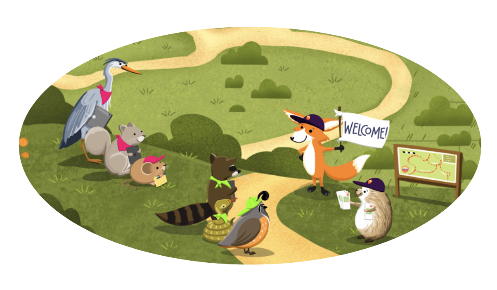

# Fall 2024 California Water Boards Openscapes Champions Cohort

Welcome to the Fall 2024 California Water Boards Openscapes Champions Cohort! This is a Cohort for the California State and Regional Water Boards ([SWRCB](https://www.waterboards.ca.gov/), "Water Boards"), with the Instruction Team led by staff from the Office of Information Management and Analysis ([OIMA](https://www.waterboards.ca.gov/resources/oima/)). For more information, visit [Openscapes at the Water Boards](https://cawaterboarddatacenter.github.io/swrcb-openscapes/).

## Cohort Agendas

We will meet as a Cohort via Microsoft Teams five times over two months for 2 hours, on alternating Wednesdays in August, September, and October 2024.

-   **Dates: August 7 & 21, September 9 & 18, October 2**
-   **Times: 9:30-11:30 am PT**
-   **Location: Remotely, via Microsoft Teams**

Agenda links below are only accessible to Cohort participants, as they are also an archive of our of our shared notes. Please see <https://openscapes.org/series> for more detail and to view blank versions of the agendas.

| Date  | Cohort Call Agendas                                                                                                                                                                                                                                                                                                                    | Presentation Slides                                                                                                                                                                                                   | Openscapes Lessons                                                                                                                                                                                   | Between Cohort Calls                                                   |
|---------------|---------------|---------------|---------------|---------------|
| 08/07 | 1\. Openscapes mindset    | mindset, better science for future us    | [mindset](https://openscapes.github.io/series/core-lessons/mindset.html), [better science in less time](https://openscapes.github.io/series/core-lessons/better-science.html)                        | Seaside Chat (reflection, orient to the Pathway)                       |
| 08/21 | 2\. Culture & safety and Intro to the Pathway & Seaside Chats prep | culture & safety, Pathway & Seaside Chats | [team culture](https://openscapes.github.io/series/core-lessons/team-culture.html), [Pathways](https://openscapes.github.io/series/core-lessons/pathways.html)                                       | Seaside Chat (Pathway trailhead); Co-working                           |
| 09/04 | 3\. GitHub for publishing and Documentation | GitHub for publishing, documentation | [GitHub for publishing](https://openscapes.github.io/series/core-lessons/github/github-pub.html), [documentation](https://openscapes.github.io/series/additional-lessons/documentation.html)         | Seaside Chat (organizing with GitHub; documentation needs); Co-working |
| 09/18 | 4\. GitHub for project management and Data strategies for future us | GitHub for project management, data strategies  | [GitHub for project management](https://openscapes.github.io/series/core-lessons/github/github-issues.html),[data strategies](https://openscapes.github.io/series/core-lessons/data-strategies.html) | Seaside Chat (Pathways); Co-working X 2                                |
| 10/02 | 5\. Pathways share   |                                                                                                                                                                                                                       | [Open communities](https://openscapes.github.io/series/core-lessons/communities.html)                                                                                                                |                                                                        |

The Water Boards has a GitHub [organization](https://github.com/CAWaterBoardDataCenter) which is currently creating its guidance for contributions. Tip: You can listen instead of read material online via [talkify](https://talkify.net/web-reader-read-any-website-aloud).

## Participating teams

These are the teams participating:

***Teams - please edit this repo to add your name next to your team and/or a description of your team's topic/focus!***

-   Unleaded:
-   UST Evaluation Team:
-   WaTR (Water Telemetry Research):
  
## Openscapes Instruction Team

-   **Instructors**: Anna Holder (OIMA), Tina Ures (DWQ)

-   **Mentors:** Madi Boynton (DWQ), Danielle Cantrell (DDW), TJ Middlemis-Clark (R6), michael ben Ortiz (OPP), Elena Suglia (OIMA), Val Zimmer (DWR)

### Guest Teachers

-   Call 1: [Stefanie Butland](https://openscapes.org/team.html) (Openscapes) - Better Science for Future Us
-   Call 3: [Corey Clatterbuck](https://www.coreyclatterbuck.com/) (California Coastal Commission) - Documentation

## More Background on Openscapes and the Champions program:

-   [**Our path to better science in less time using open data science tools**](https://www.nature.com/articles/s41559-017-0160) (Lowndes et al 2017, *Nature Ecology & Evolution*) - this paper greatly influences the whole Champions program and we'll ask that everyone participating reads it before our first Cohort Call on September 9.
-   [**Openscapes: Better Science for Future Us**](https://docs.google.com/presentation/d/1HGw4P095-lblHiGQHXYidHiVysjrPxuojxTxKtE13vk/edit#slide=id.ge2b7c2f974_0_2017) - 2021 plenary talk at the Society for Open, Reliable, and Transparent Ecology and Evolutionary biology (SORTEE) inaugural conference
-   [**Openscapes embraces kindness and inclusion in open science**](https://sparcopen.org/impact-story/openscapes-embraces-kindness-and-inclusion-of-open-science/) - 2021 article about Openscapes
-   [**openscapes.org**](https://openscapes.org/) -- Openscapes is operated at the National Center for Ecological Analysis & Synthesis, UC Santa Barbara
